# GPU vs CPU v2

## Description
  
This is an addition to the [GPU_vs_CPU](https://github.com/jonathancosme/GPU_vs_CPU) demonstration created on July 28, 2022.  

The goal of that demonstration was to showcase the speed gains from:

+ switching from the [pandas](https://pandas.pydata.org/) library to the [cuDF](https://docs.rapids.ai/api/cudf/stable/) library
+ switching from the [scikit-learn](https://scikit-learn.org/stable/) library to the [cuML](https://docs.rapids.ai/api/cuml/stable/) library
  
While the gains are significant, it is not a 'fair' comparison for the following reasons:
  
+ the pandas library is locked to using a single CPU thread
+ the scikit-learn library uses one thread by default (and only the default configurations were tested).
  
Therefore, this experiment (GPU_vs_CPU_v2) was created to address those shortcomings.
  
In this experiment, we use the [**Dask**](https://docs.dask.org/en/stable/) framework, which allows us to utilize **all CPU cores**.  
Dask also support the [Rapids.ai](https://rapids.ai/) backend, which allows us to use GPUs.  
  
For our test, we **compare performance of Dask-CPU vs Dask-GPU**, in 3 main areas: 
  
+ ETL
	+ CPU: we use the Dask DataFrame object using a Dask CPU (all cores/threads) cluster
	+ GPU: we use the Dask DataFrame object using a Dask GPU (single GPU) cluster
+ Dimensionality reduction
	+ CPU: we use scikit-learn combined with joblib + Dask CPU cluster backend
	+ GPU: we use cuML combined with Dask GPU cluster backend
+ ML model training
	+ CPU: we use scikit-learn combined with joblib + Dask CPU cluster backend
	+ GPU: we use cuML combined with Dask GPU cluster backend
  
## Hardware configuration

This experiment was run on a custom-build Desktop machine

### Relevant hardware (used in testing)  
  
(name links direct to newegg.com page; price links direct to screenshot of hardware price as of Nov 20, 2022)
  
+ CPU: [**AMD Ryzen Threadripper 3960X Processor**](https://www.newegg.com/amd-ryzen-threadripper-3960x/p/N82E16819113619) 24-cores (48-threads) @  3.8GHz) | [$1,399.99](./images/cpu.png)
+ GPU #2: [**ZOTAC GAMING GeForce RTX 3090 Trinity OC**](https://www.newegg.com/zotac-geforce-rtx-3090-zt-a30900j-10p/p/N82E16814500510?Item=9SIA6V6J5G9353&Description=rtx%203090&cm_re=rtx_3090-_-14-500-510-_-Product&quicklink=true) (PCIe 4.0) | [$1,249.99](./images/gpu.png)

  
### Other hardware

+ Motherboard: ASUS ROG Zenith II Extreme Alpha TRX40 
+ RAM: 2x G.SKILL Trident Z Neo Series (2 x 32GB) (128GB total) @ 2666 MT/s
+ SSD: 3x Kingston FURY Renegade PCIe 4.0 NVMe M.2 SSD 2TB (6TB total) 
+ GPU #0: ASUS ROG Strix GeForce RTX 3090 (PCIe 4.0) (**NOT USED IN EXPERIMENT**)
+ GPU #1: ZOTAC GAMING GeForce RTX 3060 Ti Twin Edge OC (PCIe 4.0) (**NOT USED IN EXPERIMENT**)
+ Cooling (CPU): CORSAIR iCUE H150i ELITE CAPELLIX Liquid CPU Cooler 
+ PSU: EVGA SuperNOVA 1600 P+, 80+ Platinum 1600W, Fully Modular 

## Software configuration 
+ [Linux Mint 20.3](https://linuxmint.com/edition.php?id=292)
+ [Miniconda](https://docs.conda.io/en/latest/miniconda.html)
+ [Mamba](https://github.com/mamba-org/mamba)
+ 'gvc-2' conda environment. All libraries installed can be found in the [gvc-2.yaml](gvc-2.yaml) file.

## Procedures tested

**Note:** The selection of dimensionality reduction and machine learning procedures was based on what procedures were available to ALL of the libraries used (Dask, scikit-learn, and cuML).  

### ETL
  
+ Read CSV (single file)
+ Write CSV (single file)
+ Read CSV (multiple file)
+ Write CSV (multiple file)
+ Describe dataframe
+ Set index on dataframe
+ Concat multiple dataframes
+ Groupby aggregation (mean)
+ Fit label encoder
+ Encode data
+ Scale data
+ split data
  
### Dimensionality reduction
  
+ PCA
+ TruncatedSVD

### Machine learning models

+ OLS linear regression
+ k-means
+ gradient boosting

## Results

### Summary  
  
* For **ETL**, we see more than **70% reduction in time**
* For **Dimenstionality Reduction**, we see a more than **83% reduction in time**
* For **Machine Learning**, we see a more than **91% reduction in time**
* **End-to-end**, we see a more than **74% reduction in time**    

| | | | |
|:-------------------------:|:-------------------------:|:-------------------------:|:-------------------------:|
|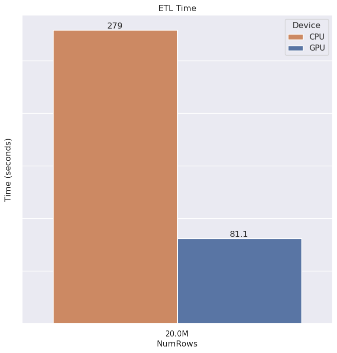||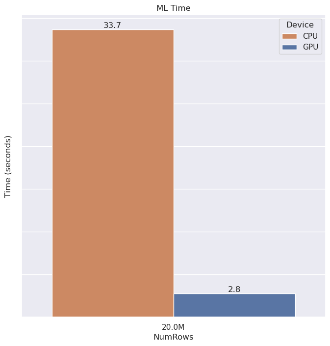|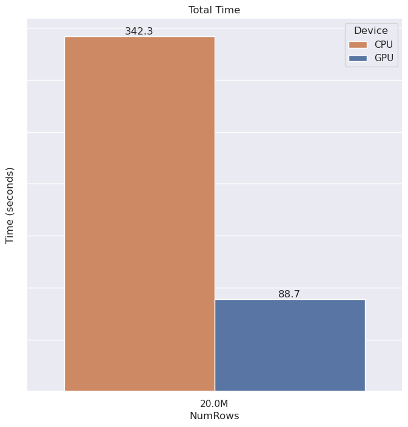|

### Individual Task Figures

#### ETL

| | | |
|:-------------------------:|:-------------------------:|:-------------------------:|
|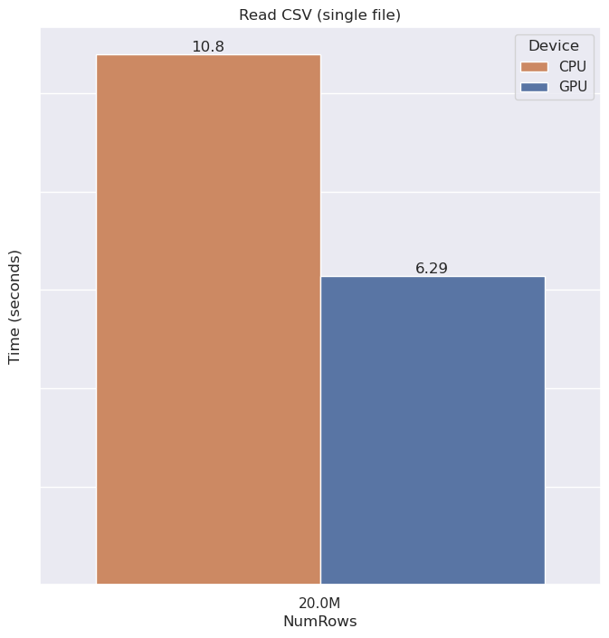|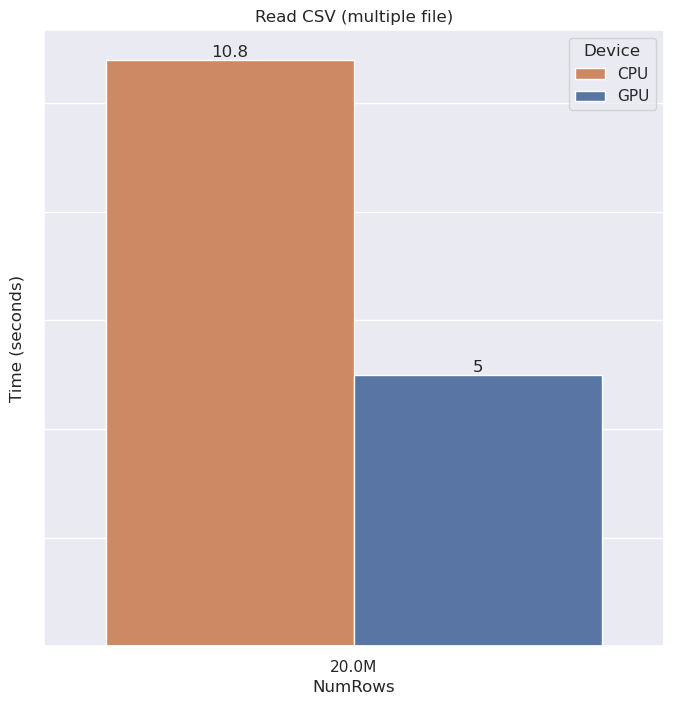|  
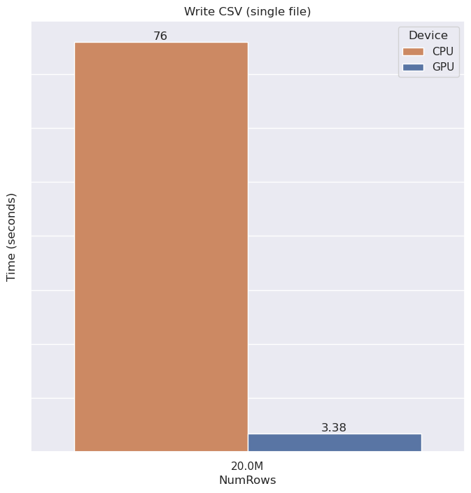|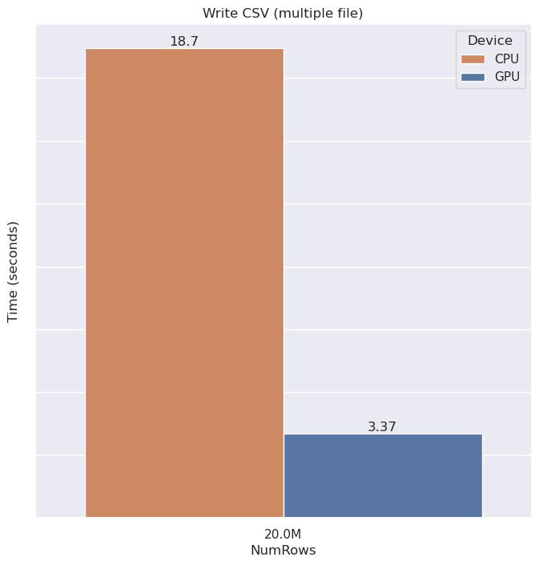|  
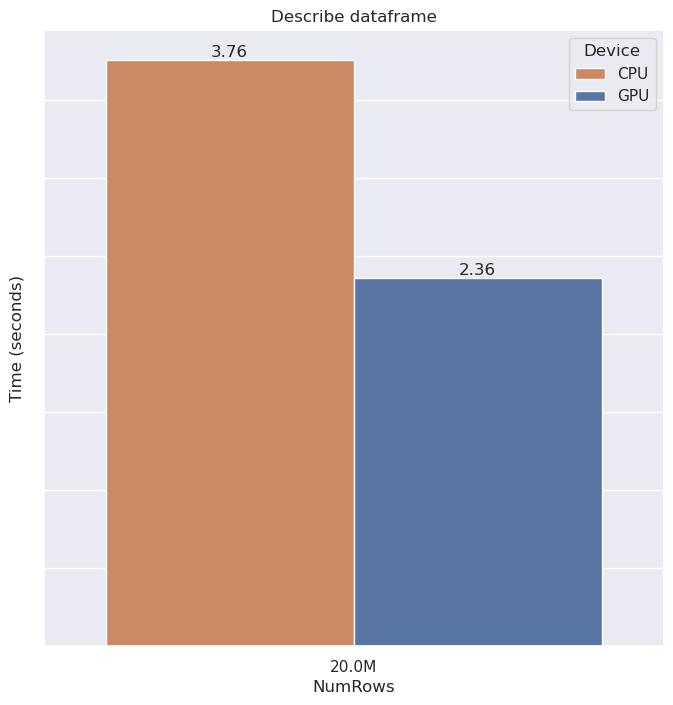|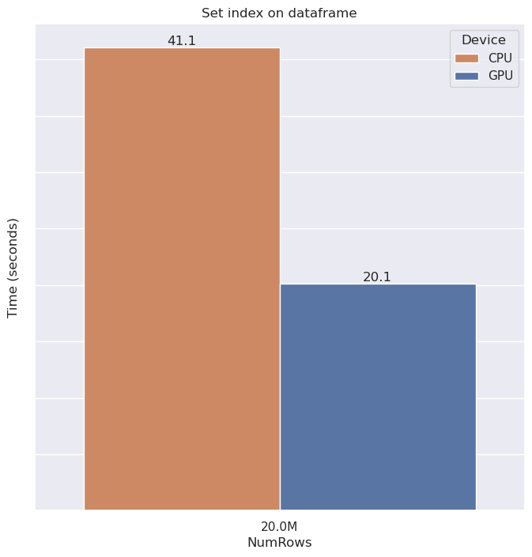|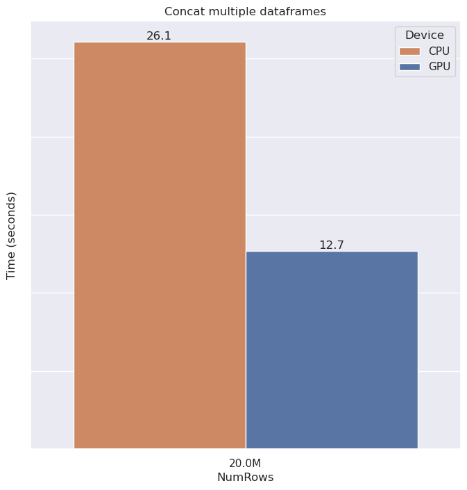|  
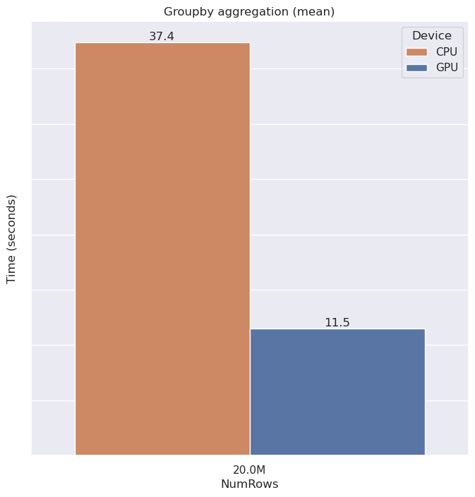|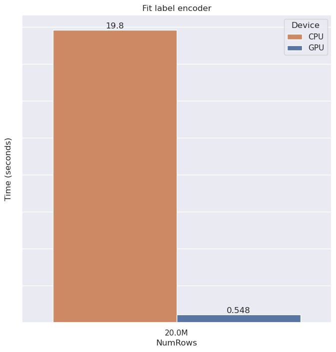|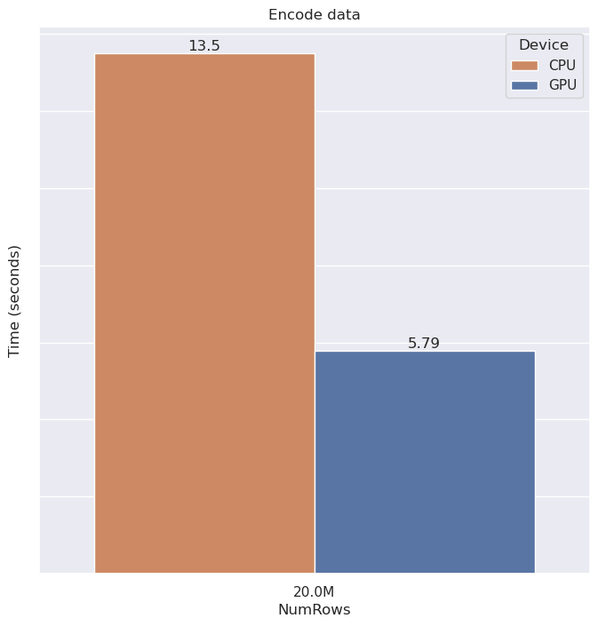|  
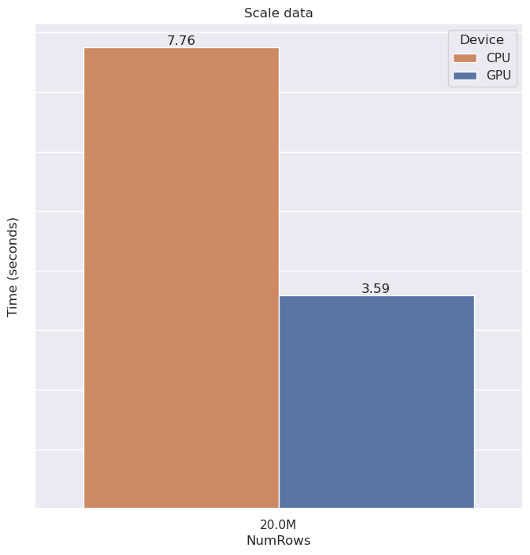|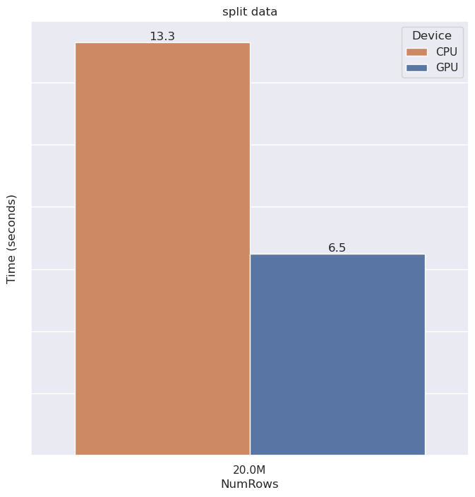|

#### Dimenstionality Reduction

| | | |
|:-------------------------:|:-------------------------:|:-------------------------:|
|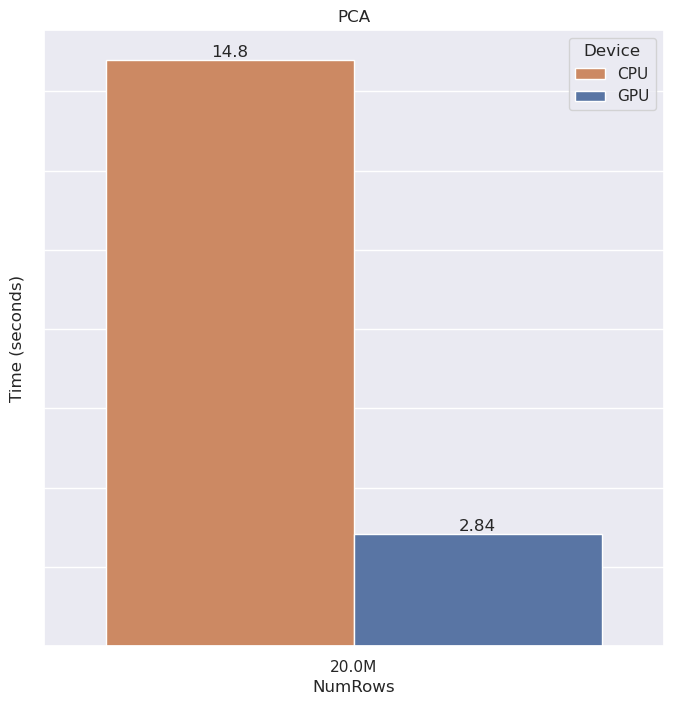|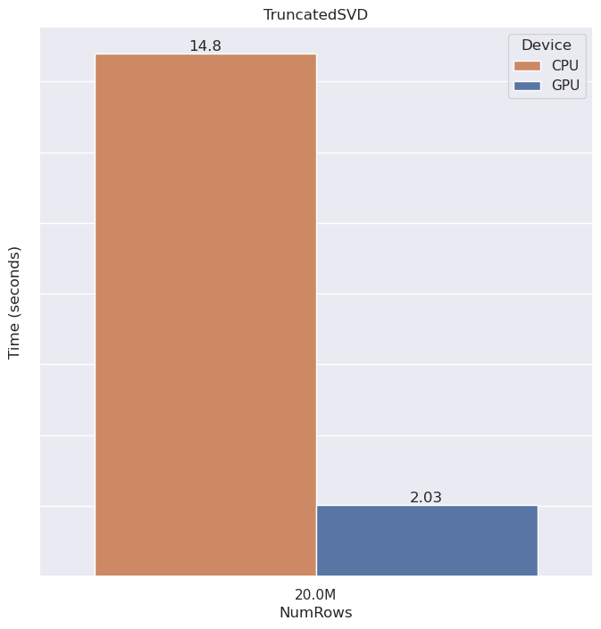|

#### Machine Learning

| | | |
|:-------------------------:|:-------------------------:|:-------------------------:|
|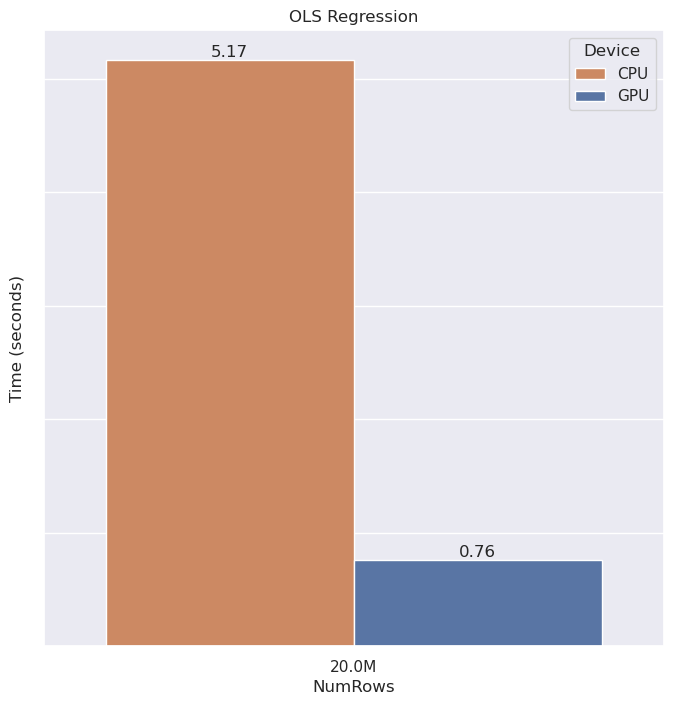|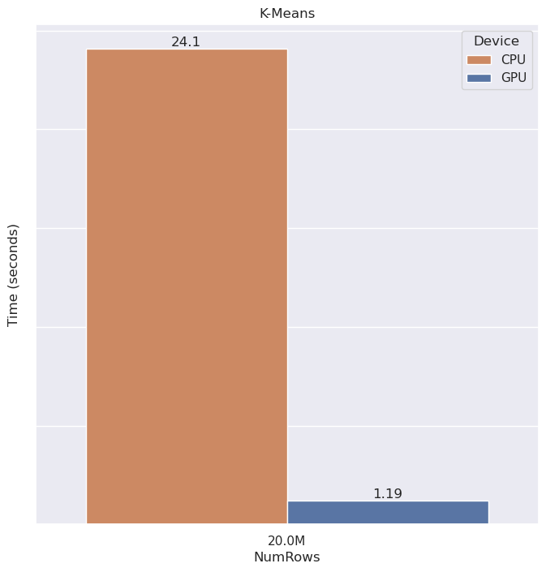|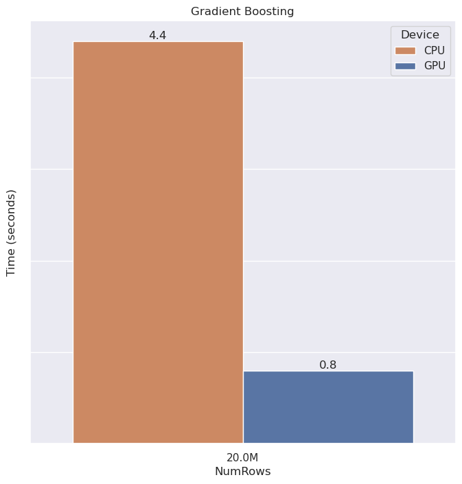|

## Instructions

1. Clone repo
~~~bash
git clone https://github.com/jonathancosme/GPU_vs_CPU_v2.git
~~~  

2. Navigate into repo directory
~~~bash
cd GPU_vs_CPU_v2
~~~  

3. Create conda environment
~~~bash
mamba env create -n gvc-2 -f gvc-2.yaml
~~~  

4. Activate environment
~~~bash
conda activate gvc-2
~~~  
  
5. Set environment variable for GPU to use in experiment. In my case, I wanted to use the GPU in PCI slot #2, so I ran CUDA_VISIBLE_DEVICES=2. Set CUDA_VISIBLE_DEVICES={PCI slot # you want to use}. **If you only have ONE GPU on your machine, you can skip this step**.
~~~bash
export CUDA_DEVICE_ORDER=PCI_BUS_ID && export CUDA_VISIBLE_DEVICES=2
~~~  
  
6. start Jupyter lab
~~~bash
jupyter lab
~~~  
  
7. Download data
The dataset used was a **fake dataset** generated by me, conatining 10 columns and 20 millions rows.  
It is a binary classification problem for detecting counterfeit drugs, and available for public download via Google Drive: [sample_data_20m.csv](https://drive.google.com/file/d/1sFKqsEMUnxttsu4LpogTs1zJ2qqvh1ye/view?usp=sharing)
  
8. Move downloaded csv file into the folder **GPU_vs_CPU_v2/sample_data**

9. In Jupyter lab UI, open **CPU_demo_v2.ipynb** or **GPU_demo_v2.ipynb**
  
10. From the Jupyter lab menu, select **Run** > **Run All Cells**